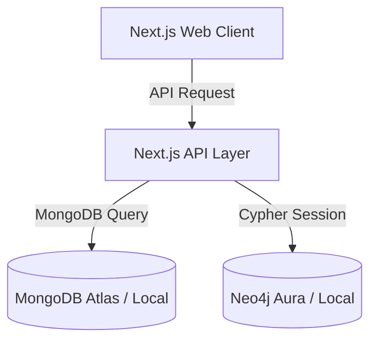

# Pokémon Evolution & Type Effectiveness Analysis Network

A high-performance multi-database web application designed to query, traverse, and build Pokémon teams, utilizing **MongoDB** for document archives and **Neo4j** for relational graph networks.

---

## 1. System Architecture

The application separates concerns by storing flat documents and base statistics in MongoDB while using Neo4j for relationship-heavy traversals such as evolution paths, element type effectiveness, and team building.



### Module Features

1. **Pokédex (MongoDB)**: Search Pokémon and view detailed stats, descriptions, categories, heights, and weights.
2. **Evolution Chain Graph (Neo4j)**: Traverse evolution paths downstream using variable-length relationship matching and render as BFS-level columns.
3. **Type Effectiveness (Neo4j)**: Analyze offensive type multipliers and defensive element vulnerabilities on a dedicated interactive details page.
4. **Team Builder (Neo4j & MongoDB)**: Build teams of up to 6 members, run live validation checks for duplicates, and evaluate team vulnerabilities using Neo4j type relationships.

---

## 2. Getting Started

### Local Setup (Using Docker Compose)

The entire three-tier stack (MongoDB, Neo4j, and Next.js) can be launched locally using a single command:

1. Clone or copy the project files to your environment.
2. Run the build and start commands:
   ```bash
   docker compose up --build
   ```
3. Once the database services report healthy, the Next.js server will be available at `http://localhost:3000`.

### Manual Development Setup

1. **Install dependencies**:

   ```bash
   npm install
   ```

2. **Configure environment variables**: (example .env)
   Create a `.env.local` file in the root directory:

   ```env
   MONGODB_URI=mongodb://localhost:27017/pokemondb
   NEO4J_URI=bolt://localhost:7687
   NEO4J_USERNAME=neo4j
   NEO4J_PASSWORD=password
   ```

3. **Seed the database**:
   Run the seeding script to populate MongoDB and Neo4j nodes/relationships with the Purukitto Pokémon dataset:

   ```bash
   npm run seed
   ```

4. **Start Next.js development server**:
   ```bash
   npm run dev
   ```

---

## 3. Benchmarking Database Operations

Performance tests were executed on query response latencies using remote Neo4j Aura and MongoDB databases. Benchmark results and metrics plots are stored in:

### Neo4j Graph Benchmarks
- Results: [benchmarks/scripts/neo4j/results/](file:///c:/Users/Saddam%20Titanio/Desktop/UI/pokemon-evolution-type-effectiveness/benchmarks/scripts/neo4j/results/)
- Plots: [benchmarks/scripts/neo4j/plots/](file:///c:/Users/Saddam%20Titanio/Desktop/UI/pokemon-evolution-type-effectiveness/benchmarks/scripts/neo4j/plots/)

### MongoDB Document Benchmarks
- Results: [benchmarks/scripts/mongodb/results/](file:///c:/Users/Saddam%20Titanio/Desktop/UI/pokemon-evolution-type-effectiveness/benchmarks/scripts/mongodb/results/)
- Plots: [benchmarks/scripts/mongodb/plots/](file:///c:/Users/Saddam%20Titanio/Desktop/UI/pokemon-evolution-type-effectiveness/benchmarks/scripts/mongodb/plots/)

To run the Neo4j benchmarks manually:

```bash
npx tsx benchmarks/scripts/neo4j/effectiveness_query.ts
npx tsx benchmarks/scripts/neo4j/evolution_query.ts
npx tsx benchmarks/scripts/neo4j/team_validation.ts
npx tsx benchmarks/scripts/neo4j/weakness_analysis.ts
```

To run the MongoDB benchmarks manually:

```bash
npx tsx benchmarks/scripts/mongodb/pokemon_query.ts
npx tsx benchmarks/scripts/mongodb/list_query.ts
```

To plot the performance latency graphs for both databases:

```bash
python benchmarks/scripts/neo4j/plot_results.py
```

---

## 4. Design & Implementation Decisions

Detailed design and system configuration documentation is available in the `docs` folder:

- [docs/architecture.md](file:///c:/Users/Saddam%20Titanio/Desktop/UI/pokemon-evolution-type-effectiveness/docs/architecture.md): System layout and transaction sequence diagrams.
- [docs/data-models.md](file:///c:/Users/Saddam%20Titanio/Desktop/UI/pokemon-evolution-type-effectiveness/docs/data-models.md): MongoDB document schemas and Neo4j node/edge attributes.
- [docs/design-decisions.md](file:///c:/Users/Saddam%20Titanio/Desktop/UI/pokemon-evolution-type-effectiveness/docs/design-decisions.md): Choices behind polyglot storage splits, dynamic calculations, and casing resolutions.
- [docs/graph-schema.md](file:///c:/Users/Saddam%20Titanio/Desktop/UI/pokemon-evolution-type-effectiveness/docs/graph-schema.md): Graphic diagram of nodes and connections.

---

## 5. Team Info & Citations

### Team Members

- Saddam Titanio (2406450472)
- Nicolas Chriscia (2406369015)
- Mochammad Rafly Fatih Rabbani (2406369021)

### Contributions

#### Nico (Nicolas Chriscia)
- Create the MongoDB database
- Insert Pokémon data
- Write MongoDB queries
- Connect frontend to backend
- Test MongoDB queries

#### Hafizh (Mochammad Rafly Fatih Rabbani)
- Make the frontend interface
- Display Pokémon data from MongoDB
- Display the evolution chain and type effectiveness from Neo4j
- Handle user input
- Test the system to make sure everything works
- Measure and run performance tests (benchmark)
- Save the results in CSV or JSON and make charts
- Write the benchmarking section for the report

#### Saddam (Saddam Titanio)
- Create the backend program
- Connect the backend to MongoDB and Neo4j
- Create Pokémon nodes and relationships in Neo4j
- Write Neo4j queries
- Create docker-compose.yml file
- Combine query results from both databases
- Test Neo4j queries
- Handle backend API integration

### Citations and AI Assitance Acknowledgement

- Pokémon dataset sourced from the public repository [Purukitto/pokemon-data.json](https://github.com/Purukitto/pokemon-data.json).
- AI Assistant was used exclusively to assist with script writing, plotting latency graphs, database seeding, and drafting documentation files.
- Front-end layout, database schemas, and service-repository code structures were designed and implemented jointly during pair programming.
