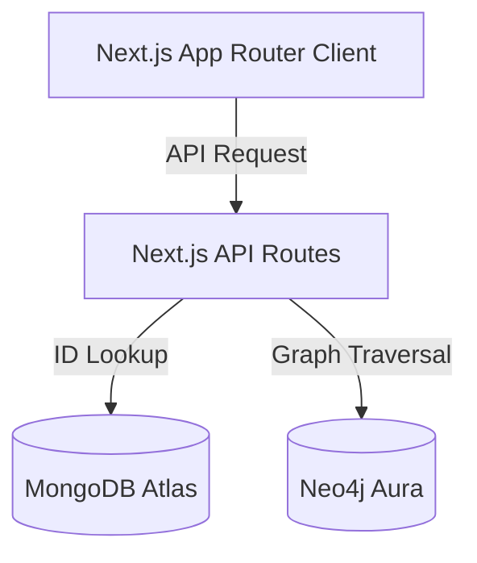

# Architecture

This document describes the architectural flow, component relationships, and API request sequences.

---

## 1. System Components

The application is built as a three-tier system:
1. **Frontend (Next.js client-side component pages)**: A reactive web dashboard styled with CSS and Tailwind, supporting Pokédex searching, SVG evolution tree views, interactive type effectiveness matrixes, and a team builder workspace.
2. **Next.js API Layer (Backend Routers)**: API endpoints that connect to MongoDB and Neo4j databases, perform data aggregation, validate business logic, and compute graph calculations.
3. **Database Layer (Polyglot persistence)**:
   - **MongoDB**: Used for high-speed document retrieval of Pokémon statistics and metadata.
   - **Neo4j**: Graph database used for traversing relationships (evolution chains, type effectiveness, and team associations).

---

## 2. Dynamic Workflows

### 1. Pokédex Retrieval Flow
1. User enters `/pokedex` and searches for a Pokémon.
2. Frontend requests `/api/pokemon/[slug]`.
3. Backend fetches the Pokémon document from MongoDB.
4. If found, backend uses the Pokémon's numerical `id` to query Neo4j for its elemental types and defensive weaknesses.
5. Backend aggregates the MongoDB document data and Neo4j type data, returning a single response.

### 2. Evolution Chain Traversal
1. User searches for a Pokémon's evolution chain.
2. API route `/api/evolution/[name]` runs a Cypher query.
3. The query finds the "root" of the evolution chain (the ancestor node with no incoming `EVOLVES_TO` edges).
4. The query traverses downstream using a variable-length relationship pattern `(base)-[:EVOLVES_TO*0..]->(member)` to retrieve all ancestors and successors in the family tree.
5. The frontend groups the nodes into columns based on their depth in the tree (via Breadth-First Search) and draws the SVG graph.

### 3. Team Builder CRUD and Validation
1. User builds a team in the workstation.
2. When members change, frontend calls `POST /api/team-builder/validate` passing the list of names.
3. Neo4j checks if the names exist, searches for duplicate nodes, and calculates element vulnerabilities.
4. When the user saves, `POST /api/team-builder` creates a `Team` node, and creates `[:HAS_POKEMON]` edges to the respective `Pokemon` nodes in Neo4j.
